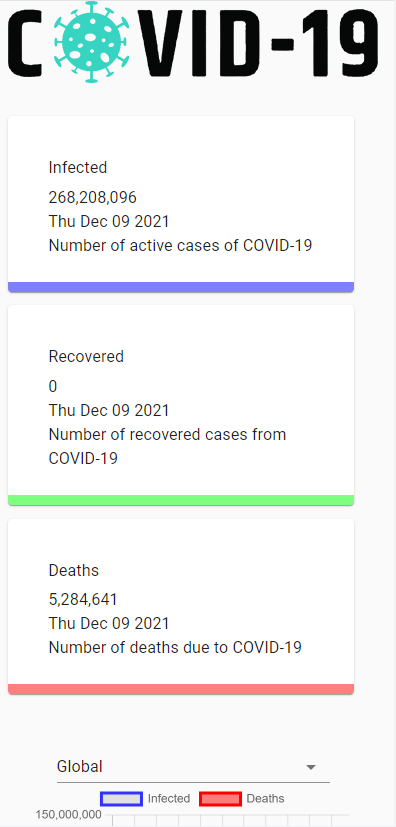

# Covid-19 Tracker App
> This is Project 02 of the Bootcamp 2020.

A Simple coid cases and fatalities tracker app and display information in graphs.

## Tech Stack Used

React.JS (featuring useSate, useEffects Hooks, Fetch API Data)

React-Chart-js-2 (React Chart.js to show information using Line and Bar Graphs)

Material UI

CSS

HTML

Github Actions

Surge Deployment via Github Actions

## Project Links

Repo: https://github.com/MuhammadUsman247/covid19-tracker-app

Demo: https://prj02-covid19-tracker-app.surge.sh

## Release History

* 0.0.1
    * Successfully deployed project 02 of bootcamp 2020

## Meta

Muhammad Usman – [@YourTwitter](https://twitter.com/murh279) – musman.247a@gmail.com

Distributed under the XYZ license. See ``LICENSE`` for more information.

[https://github.com/MuhammadUsman247/covid19-tracker-app](https://github.com/MuhammadUsman247/)
